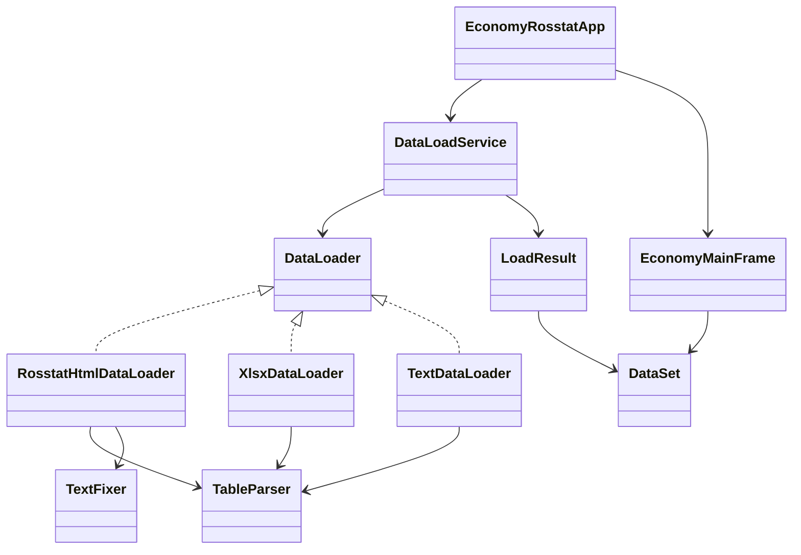

# Приложение по экономике (Java, ООП)

Приложение показывает покупательную способность по выбранному году и списку продуктов на данных Росстата.

## Архитектура

- `app` — точка входа приложения.
- `ui` — графический интерфейс.
- `model` — доменные модели.
- `service` — orchestration/бизнес-логика загрузки.
- `loader` — источники данных (сайт, xlsx, txt).
- `parser` — общий парсер таблиц.
- `util` — утилиты (в т.ч. исправление кодировки).

## Диаграмма классов



## Запуск

```bash
javac app/EconomyRosstatApp.java model/*.java service/*.java loader/*.java parser/*.java util/*.java ui/*.java
java app.EconomyRosstatApp
```
